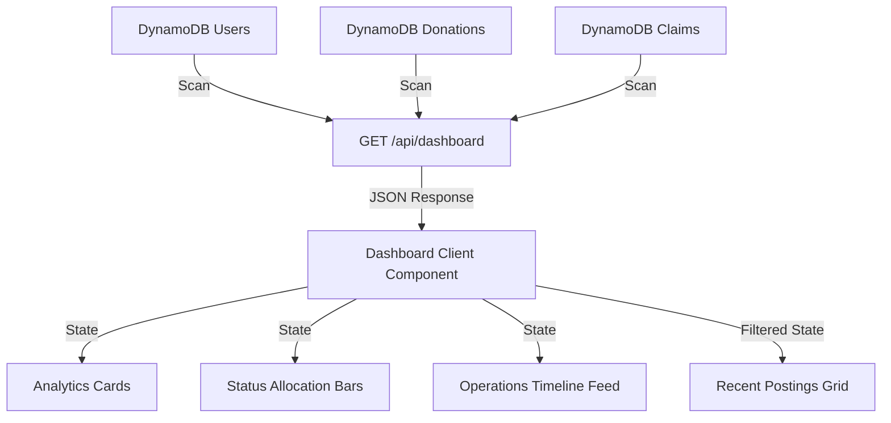

# FoodBridge - Phase 6: Dashboard Analytics & Operations Center

This document describes the design, dashboard architecture, event timeline generator, component hierarchy, and API structures implemented for Phase 6.

---

## 1. Dashboard Architecture

The dashboard serves as the central **Operations Center** for FoodBridge. It aggregates data in real-time from DynamoDB tables (`Users`, `Donations`, and `Claims`) and visualizes platform statistics, participant ratios, status allocations, and historical audit timelines.

### Data Flow



---

## 2. Component Hierarchy

The dashboard view is composed of modular, lightweight, reusable UI components:

```
DashboardPage (/dashboard)
 ├── Header
 ├── SearchBar (Keyword Search)
 ├── AnalyticsCard (Grid items for counts)
 ├── Platform Summary (Partner and meal ratios)
 ├── StatusOverview (Linear progress allocations)
 ├── ActivityTimeline (Vertical timeline audit feed)
 ├── RecentDonationCard (Row listing details with details navigation link)
 ├── QuickActionCard (Role-specific action triggers)
 ├── EmptyState (Fallback graphics)
 └── Footer
```

---

## 3. Analytics Flow & Live Timeline Event Generator

Since DynamoDB is a NoSQL store, we do not require a separate audit logs table. Instead, the backend dynamically calculates and merges timeline events from current items:

1. **Donation Creation**:
   For each listing found in the `Donations` table, a `donation_created` timeline item is compiled using the restaurant's name and listing timestamp.
2. **Status Changes**:
   If a listing status is `PICKED_UP` or `COMPLETED`, appropriate status change timeline events are pushed with fallbacks based on creation timestamps to preserve chronology.
3. **Claims Activity**:
   For every entry in the `Claims` table, a `donation_claimed` event is added containing the claiming NGO's name and the corresponding food name.
4. **Sorting**:
   All timeline events are merged, sorted chronologically descending, and sliced to the top 10 most recent entries.

---

## 4. API Usage

### `GET /api/dashboard`
Returns a unified payload:
- **`stats`**: Contains totals for meals shared, NGO partners, active restaurants, total claims, and counts of donations broken down by status.
- **`recentActivity`**: Array of 10 timeline entries formatted with icons, titles, and descriptions.
- **`latestDonations`**: Array of the 5 newest listings resolving restaurant names from the `Users` table.

---

## 5. Future Improvements

- **Interactive Charts**: Introduce micro-charts (like SVG area or bar sparklines) representing weekly lists of donations.
- **Location Analytics**: Display the concentration of surplus foods based on city sectors or districts.
- **SLA Tracking**: Calculate average time elapsed between listing creation (`AVAILABLE` status) and NGO claim (`CLAIMED` status) to measure coordination speed.
