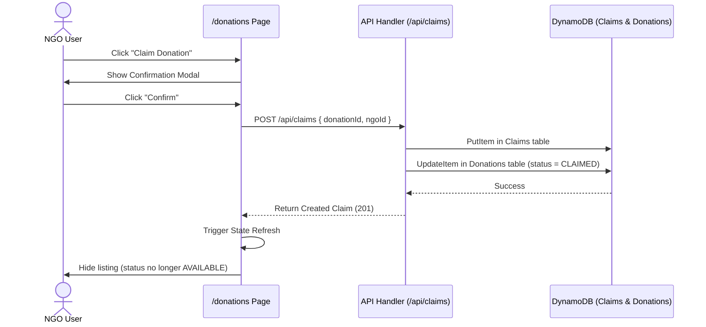

# FoodBridge - Phase 5: NGO Module Documentation

This document describes the design, user flows, role-based rendering mechanics, API integration, and folder structure implemented for the NGO Module.

---

## 1. NGO User Flow

1. **Sign In**:
   - The user visits the homepage and clicks "Sign In".
   - The user can log in via **Google OAuth** (production) or select the **Mock NGO (Dev)** bypass.
   - If they are a first-time Google user, they are redirected to `/role-selection` to choose their role ("ngo" or "restaurant").
2. **Dashboard**:
   - The user is redirected to the `/dashboard` showing live platform statistics (total donations, active listings, completed cycles, claims count).
3. **Available Donations**:
   - The user clicks on the "Available Donations" link in the header.
   - They see a list of all active listings whose status is `AVAILABLE`.
   - They can search (by food name, pickup address, or description) and apply filters (availability today/tomorrow, quantity limits, sorting by date or quantity).
4. **View Details**:
   - Clicking "View Details" takes the user to `/donations/[id]`, displaying descriptions, pickup instructions, expiry times, and restaurant contact information.
5. **Claiming a Donation**:
   - Clicking "Claim Donation" (either from the card or details page) opens a confirmation modal.
   - On confirmation, a claim is created, the donation status changes to `CLAIMED` in the database, and the listing is immediately hidden from the Available list.
6. **My Claims**:
   - The user accesses `/profile/claims` from the header.
   - They can view their personal claim log showing the food item, quantity, claiming timestamp, pickup address, and the current status (e.g. `CLAIMED`, `PICKED_UP`, or `COMPLETED`).

---

## 2. Claim Flow Diagram



---

## 3. Role-Based Rendering and Protection

FoodBridge uses role-aware page styling and routing:

- **Header / Navigation Links**:
  - NGO users see: **Dashboard**, **Available Donations**, **My Claims**.
  - Restaurant users see: **Dashboard**, **My Donations**, **Create Donation**.
  - Anonymous users see: **Home**, **Sign In**.
- **Page Context (`/donations`)**:
  - The page dynamically adjusts headers and actions.
  - Restaurant users see "My Donations" list (only their own listings) and a "Create Donation" CTA.
  - NGO users see "Available Donations" (all available listings) and cannot see the "Create Donation" CTA.
- **Route Access Protection**:
  - NGOs attempting to access `/donations/new` (donation creation form) are immediately redirected to `/dashboard`.
  - Restaurants attempting to access `/profile/claims` (claimed list) are immediately redirected to `/dashboard`.
  - Unauthenticated users are redirected back to the root page (`/`).

---

## 4. API Usage

The NGO module integrates directly with the existing endpoints:

- `GET /api/donations` - Fetches all donations. The endpoint has been updated to automatically resolve `restaurantName` by matching the `restaurantId` with the `Users` table using the existing service layer.
- `GET /api/donations/[id]` - Fetches a single donation by ID. Resolves and returns `restaurantName` and `restaurantEmail` dynamically.
- `POST /api/claims` - Creates a claim mapping `claimId`, `donationId`, `ngoId`, and `claimedAt`, and updates the corresponding donation's status to `CLAIMED`.
- `GET /api/claims` - Fetches all claims to filter and build the personal claims dashboard for the logged-in NGO user.

---

## 5. Folder Structure

The additions and updates are integrated as follows:

```
src/
  ├── actions/
  │   └── user.ts             # Server Action to update user role in DynamoDB
  ├── app/
  │   ├── api/
  │   │   ├── auth/
  │   │   │   └── [...nextauth]/
  │   │   │       └── route.ts # NextAuth Route Handler (GET/POST)
  │   │   └── donations/
  │   │       └── [id]/
  │   │           └── route.ts # Updated to support Next.js 15 async params and restaurant name resolution
  │   ├── donations/
  │   │   ├── [id]/
  │   │   │   └── page.tsx    # Role-aware details page with claim flow & status actions
  │   │   ├── new/
  │   │   │   └── page.tsx    # Protected creation page connected to real POST API
  │   │   └── page.tsx        # Role-aware index page with search and filtering
  │   ├── profile/
  │   │   └── claims/
  │   │       └── page.tsx    # Protected NGO Claims Log page
  │   └── role-selection/
  │       └── page.tsx        # Post-signup role picker client page
  ├── components/
  │   ├── donations/
  │   │   ├── ClaimButton.tsx
  │   │   ├── ClaimHistoryCard.tsx
  │   │   ├── ConfirmationModal.tsx
  │   │   ├── DonationCard.tsx
  │   │   ├── FilterDropdown.tsx
  │   │   └── SearchBar.tsx
  │   ├── layout/
  │   │   ├── Header.tsx      # Role-aware Header with login dropdown & dev mock authentication
  │   │   └── Providers.tsx   # Client session provider wrapper
  │   └── ui/
  │       ├── EmptyState.tsx
  │       ├── LoadingSpinner.tsx
  │       └── StatusBadge.tsx
  └── types/
      └── next-auth.d.ts     # Typings for custom session/user properties (id, role)
```

---

## 6. Future Improvements

- **Pagination & Server-side filtering**: Implement server-side pagination for scan commands to handle scaling datasets.
- **Location-based Radius Search**: Use browser geolocation to sort listings by distance to the NGO's location.
- **Notifications**: Integrate push notifications or SMS to alert NGOs when restaurants near them post fresh donations.
